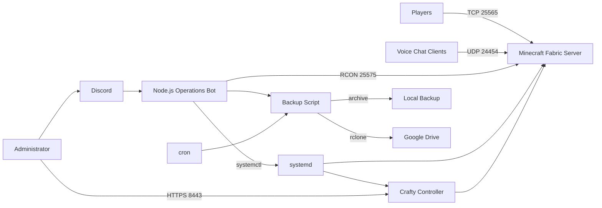

# Minecraft Server Infrastructure & Automation

A hands-on Linux infrastructure project built around operating a persistent Minecraft Java server on an Ubuntu VPS.

The project started as a PaperMC server managed directly with `systemd`, then evolved into a Fabric-based server with a web management layer, automated cloud backups, Discord-based operations, performance profiling, and server-side optimization.

> **Portfolio focus:** Linux administration, service management, application migration, automation, remote operations, backups, observability, security, and troubleshooting.

## Project Highlights

- Migrated an existing Minecraft world from **PaperMC to Fabric** while preserving Overworld, Nether, and End data.
- Ran the server on **Ubuntu 22.04 / OpenVZ** with Java 21 and resource-constrained VPS hardware.
- Managed services with **systemd** and later added **Crafty Controller** as a web-based management layer.
- Built a custom **Node.js Discord bot** for remote server operations using Discord slash commands, Linux service control, and RCON.
- Automated scheduled backups to **Google Drive with rclone**.
- Used cron, shell scripting, systemd, RCON, and restricted `sudoers` permissions to automate administration.
- Diagnosed severe tick lag using Linux tools, Minecraft logs, and Spark-style profiling techniques.
- Used Fabric performance mods and chunk pre-generation to reduce runtime load.
- Operated an offline-mode server with an authentication layer and documented the associated security trade-offs.

## Architecture



## Technology Stack

| Area | Technology |
|---|---|
| OS | Ubuntu 22.04 VPS |
| Virtualization | OpenVZ |
| Runtime | Java 21, Node.js 20 |
| Minecraft | Java Edition 1.21.10, Fabric |
| Process management | systemd |
| Web management | Crafty Controller |
| Automation | Bash, cron |
| Cloud backup | rclone + Google Drive |
| Discord automation | Discord.js v14, rcon-client, dotenv |
| Remote console | Minecraft RCON |
| Profiling / diagnostics | `top`, `htop`, server logs, Spark |
| Performance mods | Lithium, FerriteCore, C2ME, ModernFix, Krypton, Chunky |
| Authentication | EasyAuth |
| Voice | Simple Voice Chat |

## Repository Structure

```text
.
├── README.md
├── SECURITY.md
├── GITHUB_SETUP.md
├── docs/
│   ├── architecture.md
│   ├── migration-paper-to-fabric.md
│   ├── automation-and-backups.md
│   ├── discord-operations.md
│   ├── performance-troubleshooting.md
│   ├── security-design.md
│   ├── project-timeline.md
│   └── resume-bullets.md
├── examples/
│   ├── minecraft.service.example
│   ├── crafty.service.example
│   ├── discord-bot.service.example
│   ├── sudoers.example
│   └── .env.example
├── scripts/
│   └── mc_restart.example.sh
├── bot/
│   ├── README.md
│   ├── index.example.js
│   └── package.json
└── screenshots/
    └── README.md
```

## 1. PaperMC → Fabric Migration

The original server used PaperMC. I migrated the existing world to Fabric to keep behavior closer to vanilla Minecraft while still allowing server-side optimization mods.

The critical migration detail was the world layout:

```text
Paper:
world/
world_nether/DIM-1/
world_the_end/DIM1/

Fabric / Vanilla:
world/
├── DIM-1/
└── DIM1/
```

The migration included:

1. Stopping the server and taking a full backup.
2. Moving the Nether `DIM-1` directory into `world/`.
3. Moving the End `DIM1` directory into `world/`.
4. Removing Paper-specific runtime/configuration files after verification.
5. Installing the Fabric server launcher and Fabric API for Minecraft 1.21.10.
6. Updating the service startup command from the Paper JAR to the Fabric launcher.
7. Starting the server and validating the existing world and dimensions.

See [docs/migration-paper-to-fabric.md](docs/migration-paper-to-fabric.md).

## 2. Service Management

The server was initially managed as a native `systemd` service. This provided predictable start/stop/restart behavior and allowed other automation to call `systemctl` rather than manage raw Java processes.

A later phase added Crafty Controller as a web management layer. Crafty itself was configured to run under `systemd`, making the panel persistent across SSH sessions and reboots.

Sanitized service examples are available under [`examples/`](examples/).

## 3. Discord Operations Bot

I built a custom Node.js bot to control server operations from Discord.

Implemented slash commands included:

- `/start`
- `/stop`
- `/status`
- `/backup`
- `/exec`

The bot combined two control paths:

- **systemd** for service-level operations.
- **RCON** for Minecraft console commands while the server was online.

The bot ran as its own `discord-bot.service`, used environment variables for sensitive configuration, and limited administrative commands to an authorized-user allowlist.

See [docs/discord-operations.md](docs/discord-operations.md).

## 4. Automated Backups

Backups were automated through a shell script and cron.

The final documented automation flow was:

```text
03:00 UTC cron
      |
      v
mc_restart.sh
      |
      +--> warn players
      +--> stop Minecraft cleanly
      +--> archive server data
      +--> upload with rclone
      +--> Google Drive
      +--> log result
      +--> reboot VPS
```

The operational script was located at:

```text
/usr/local/bin/mc_restart.sh
```

The cron job ran as the main server user at `03:00 UTC`, with output logged to a dedicated file.

A sanitized reference script is included at [`scripts/mc_restart.example.sh`](scripts/mc_restart.example.sh). It demonstrates the design without publishing credentials or server-specific paths.

## 5. Performance Troubleshooting

A major part of the project was diagnosing periodic severe tick lag. Symptoms included:

- `Can't keep up! Is the server overloaded?`
- large tick delays
- vehicle `moved too quickly` warnings
- CPU saturation during joins or chunk-heavy movement

The troubleshooting process included:

- Monitoring CPU, memory, I/O wait, and CPU steal time with `top`/`htop`.
- Checking Java, Crafty, and OS process utilization independently.
- Pre-generating several thousand blocks with Chunky.
- Limiting chunk-generation parallelism while testing C2ME.
- Reducing view/simulation workload during constrained-VPS testing.
- Reviewing mod interactions and startup warnings.
- Using profiling tools such as Spark to identify main-thread hotspots.
- Separating Java heap pressure from CPU and host-level virtualization issues.

The server used a performance-oriented Fabric stack including Lithium, FerriteCore, C2ME, ModernFix, Krypton, and Chunky during this troubleshooting phase.

See [docs/performance-troubleshooting.md](docs/performance-troubleshooting.md).

## 6. Security Considerations

This was a private server configured in offline mode during the project. That changes the trust model because the Minecraft server itself does not verify Mojang/Microsoft identities.

Mitigations used or designed into the project included:

- EasyAuth for player authentication.
- Explicit operator/admin control.
- Discord user allowlisting.
- Environment variables for Discord/RCON credentials.
- Restricted passwordless sudo for automation rather than unrestricted root access.
- Keeping credentials, rclone tokens, RCON passwords, server worlds, and backups out of Git.

See [SECURITY.md](SECURITY.md) and [docs/security-design.md](docs/security-design.md).

## What I Learned

This project became much more than a game server. It required coordinating several real infrastructure concerns:

- preserving state during application migration;
- designing services that survive reboots;
- exposing safe operational controls to another platform;
- automating reliable backups to external storage;
- debugging performance across application, JVM, OS, and virtualization layers;
- balancing convenience with least-privilege access;
- documenting infrastructure so it can be reproduced and maintained.

## Portfolio / Resume

A concise set of resume-ready bullets is available in [docs/resume-bullets.md](docs/resume-bullets.md).

## Public Repository Notes

This repository is intentionally **sanitized**. It does not include:

- Discord bot tokens
- RCON passwords
- Crafty credentials/API keys
- rclone configuration or Google OAuth tokens
- server IP addresses
- Minecraft world/player data
- production backup archives

The `examples/` and `scripts/` files are documentation/reference versions of the infrastructure patterns used in the project, not a dump of production secrets.
