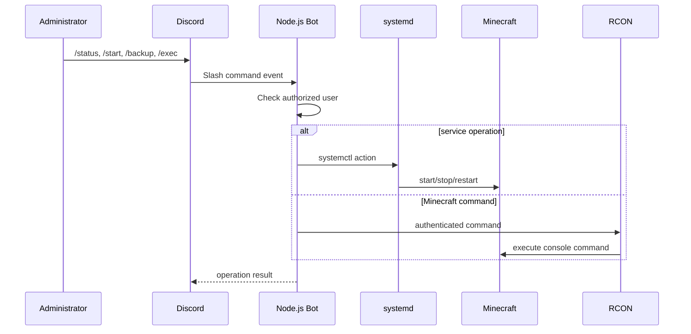

# Architecture

## Overview

The project evolved through multiple operational phases rather than being designed in one pass.

### Phase A — Native Linux service

Minecraft was run directly as a `systemd` service on Ubuntu. This made start/stop/restart operations available to cron jobs and the Discord operations bot through standard Linux service management.

### Phase B — Automation

A custom Node.js Discord bot was introduced for remote administration. It used:

- `systemctl` for power/lifecycle operations;
- Minecraft RCON for in-server commands;
- an allowlist for authorized Discord users;
- a dedicated systemd unit so the bot itself restarted automatically.

Backup automation used a shell script, cron, archive tools, and rclone.

### Phase C — Crafty Controller

Crafty Controller was later added as a web-based management layer. The existing Minecraft files were imported into Crafty's server directory, and Crafty itself was configured as a systemd-managed service.

The migration to Crafty created a second server path during transition, so directory ownership and backup paths had to be re-checked after import.

## Network Services

| Service | Typical port | Protocol | Purpose |
|---|---:|---|---|
| Minecraft | 25565 | TCP | Game server |
| RCON | 25575 | TCP | Administrative console |
| Simple Voice Chat | 24454 | UDP | Proximity voice chat |
| Crafty Controller | 8443 | HTTPS | Web management panel |

Ports are documented for architecture context only. Public exposure should be limited to what is actually required.

## Data Flow

## Reliability Design

- Long-running components are supervised by systemd.
- Backups are scheduled independently of an active SSH session.
- External backups are sent off-host to Google Drive.
- RCON is used only for actions that require an online Minecraft server.
- Service lifecycle actions are handled outside Minecraft so a stopped game server can still be started remotely.
